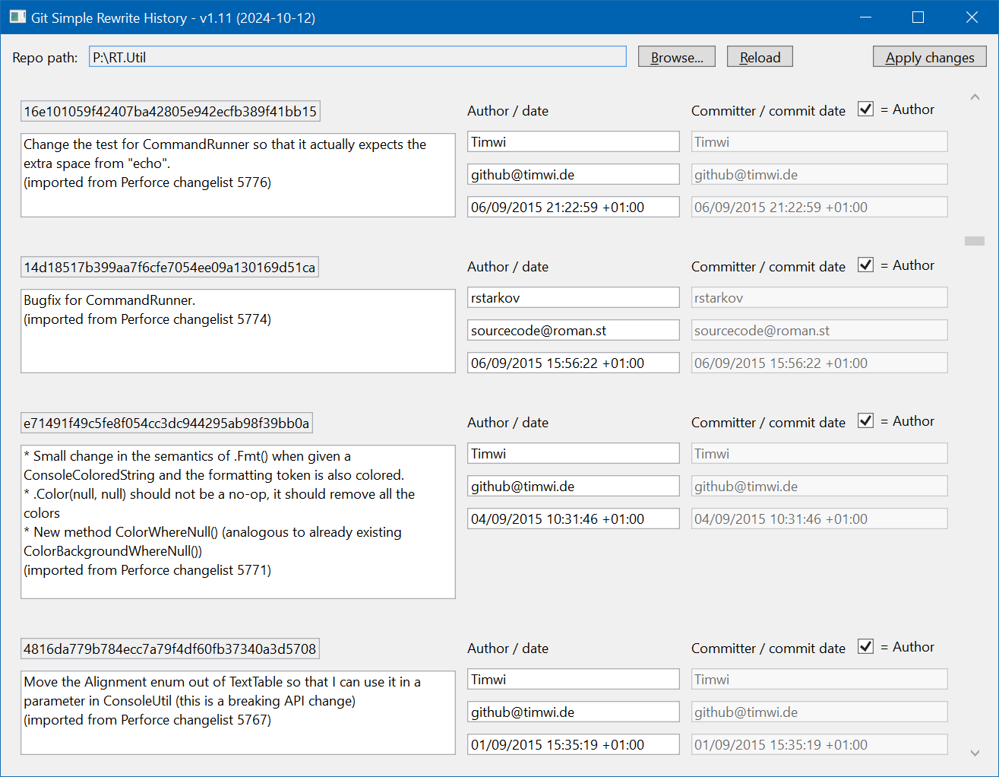

1. Backup your repo.
1. Navigate to your repo to see a list of all commits.
1. Make changes as required.
1. Hit "Apply changes" to perform the rewrite.

Note: there are various "gotchas" related to rewriting history in Git. Make sure you understand what they are!

